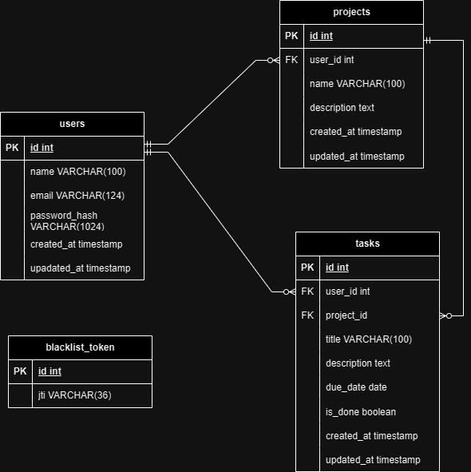
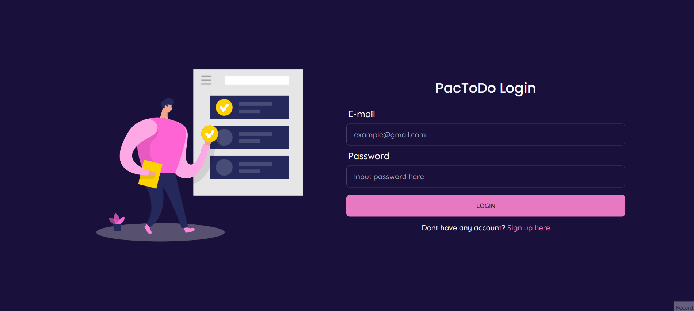
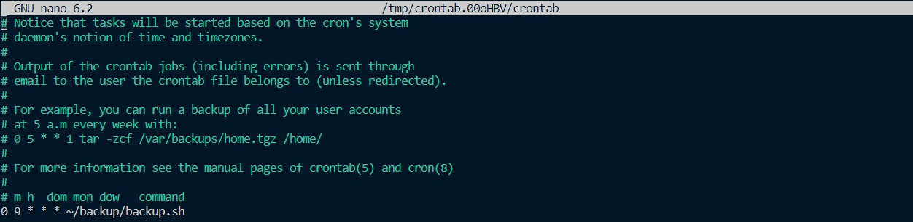

# PacToDo App: A Full Stack Simple Todo App
## Background
PacToDo App is a task and project management application that simplifies the organization of tasks and projects. Users can easily add, edit, and delete both projects and tasks. The app is seamlessly connected to a relational database, ensuring the safe and organized storage of user data.
### Features
- User Registration: Sign up and create an account to access personalized task and project management.  
- Login and Logout: Securely log in to your account and log out when you're done, ensuring the privacy of your data.  
- Task Handling: Easily add, edit, or remove tasks.
- Task Completion: Mark tasks as done when they're finished.
- Project Organization: Categorize tasks into different projects.
- Project Management: Create, edit, or delete projects.
- Filtering: Find tasks quickly by project

## Stack
- Front end: React.js, CSS Tailwind, Axios, Daisy UI  
- Back end: Flask, SQLAlchemy, PostgreSQL
- Container: Docker

## App Development
### Flow chart
#### Account Registration

#### Login

#### Projects

#### Tasks


### ERD

### Functions
|Functions   |Description   |
|---|---|
|   |   |
|   |   |
|   |   |
|   |   |
|   |   |
|   |   |
|   |   |
|   |   |
|   |   |
|   |   |
|   |   |
|   |   |
|   |   |
|   |   |
### Test Cases
#### Account Registration

#### Login (Success)

#### Login (Failed)

#### Add project

#### Edit Project

#### Delete project

#### Add task

#### Mark task as done

#### Edit task

##### Filter task by project

#### Delete task

#### Logout


## Deployment Using Docker
To ensure that the app can run seamlessly on various servers, i utilized Docker for deployment. Docker provides an isolated environment for the app, enhancing portability and security.  
### Building Container Using Docker Compose
I used Dockerfile to build image for Flask.
```
FROM python:3.10
COPY . /app
WORKDIR /app
RUN pip install -r requirement.txt
EXPOSE 5000
CMD ["python","run.py"]
```
The Flask and PostgreSQL containers are built using Docker Compose with the following configurations.
```
version: '3'
services:
    flaskapp:
      build:
        context: ./flask
        dockerfile: Dockerfile
      container_name: todo_flask
      environment:
      - SQLALCHEMY_DATABASE_URI=${SQLALCHEMY_DATABASE_URI}
      - JWT_SECRET_KEY=${JWT_SECRET_KEY}
      ports:
        - 5000:5000
      depends_on: 
        - postgres
      networks:
        - mynetworks
    
    postgres:
      image: postgres:latest
      container_name: todo_postgres
      ports:
        - 5439:5432
      environment:
      - POSTGRES_USER=${POSTGRES_USER}
      - POSTGRES_PASSWORD=${POSTGRES_PASSWORD}
      - POSTGRES_DB=${POSTGRES_DB}
      volumes:
        - postgres-volume:/var/lib/postgresql/data
        - ./postgres/init.sql:/docker-entrypoint-initdb.d/init.sql
      networks: 
        - mynetworks

networks:
  mynetworks:
volumes:
  postgres-volume:

```
Environment variables are imported from a .env file for security reasons.
### Back Up Database and Scheduling with Cron
We can back up the database by running the `backup.sh` script in the Linux terminal.
```
#!/bin/bash

source $(realpath ~/backup/config.txt)

current_datetime=$(date +"%y%m%d_%H%M%S")

container_name="todo_postgres"

backup_dir="$(realpath ~/backup/todo_postgres)"

db_user=$POSTGRES_USER

backup_file="$backup_dir/backup_$current_datetime.sql"


docker exec -i $container_name pg_dumpall -U $db_user > $backup_file

if [ $? -eq 0 ]; then
    echo "Database backup successful. Backup saved as $backup_file"
else
    echo "Database backup failed."
fi
```
The `config.txt` file contains the values of the `POSTGRES_USER` and `POSTGRES_DB` variables. I sourced it into the script so that the variables are only available while the script is running.  
To enable automatic backups, I have configured a cron service schedule to back up the database daily at 9 AM.

### Restore Database
## How to run this app
## Conclusion