# PacToDo App: A Full Stack Simple Todo App
## Background
PacToDo App is a task and project management application that simplifies the organization of tasks and projects. Users can easily add, edit, and delete both projects and tasks. The app is seamlessly connected to a relational database, ensuring the safe and organized storage of user data.
### Features
- User Registration: Sign up and create an account to access personalized task and project management.  
- Login and Logout: Securely log in to your account and log out when you're done, ensuring the privacy of your data.  
- Task Handling: Easily add, edit, or remove tasks.
- Task Completion: Mark tasks as done when they're finished.
- Task Organization: Categorize tasks into different projects.
- Project Handling: Create, edit, or delete projects.
- Filtering: Find tasks quickly by project

## Requirements
- Front end: React.js, CSS Tailwind, Axios, Daisy UI  
- Back end: Flask, Flask-Migrate, Flask-SQLAlchemy, Flask-Cors, Flask-JWT-Extended, PostgreSQL
- Container: Docker

## App Development
### Flow chart
#### Account Registration
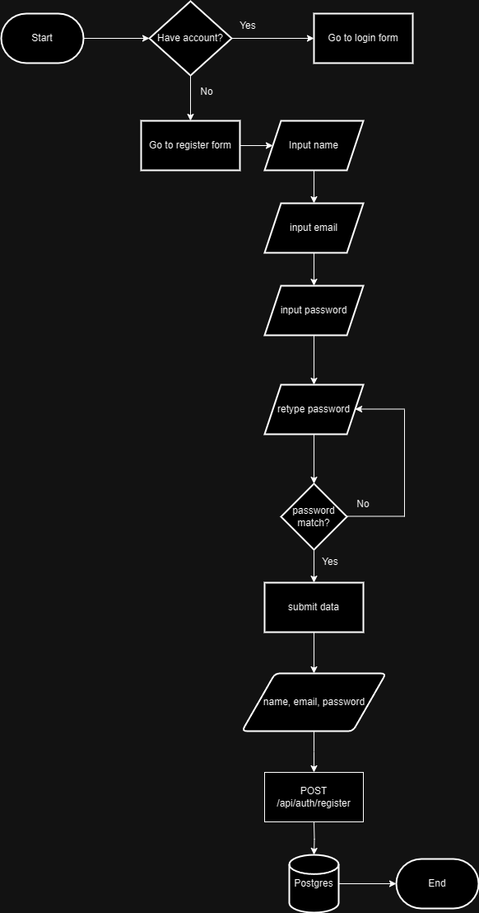
#### Login

#### Projects

#### Tasks

#### Logout


### ERD


### Demonstration
#### Account Registration
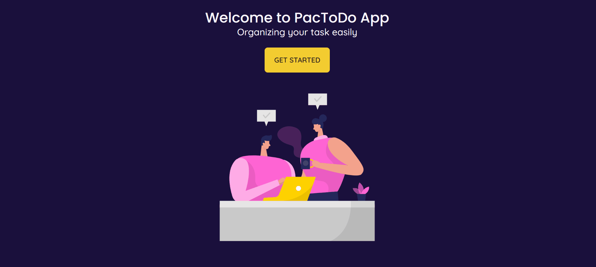
The app displays a registration form to the user, which includes validation for both email and password formats. Email addresses must adhere to the standard email format, and passwords must contain a minimum of 8 characters, including a combination of letters, numbers, and special characters. Additionally, there is a check to ensure that the password entered in the 'password' field matches the one in the 'confirm password' field. The submitted data is sent to the database via the `/api/auth/register` endpoint. The notification, whether indicating the success or failure of the registration, will be displayed to the user.
#### Login
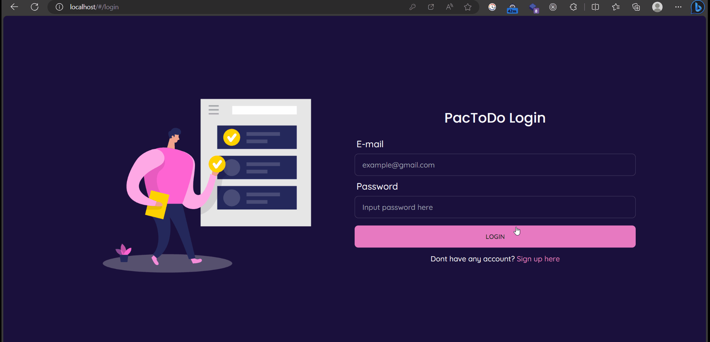
The app displays a login form to the user, featuring fields for email and password. The submitted data is sent to the database via the `api/auth/login` endpoint. If the login is successful, the Flask app returns an access token and refresh token, which are stored in the local storage. In case of a failed login attempt, a notification will be displayed to the user. Every 15 minutes the app will send request to `api/auth/refresh` to get new access token.
#### Add project
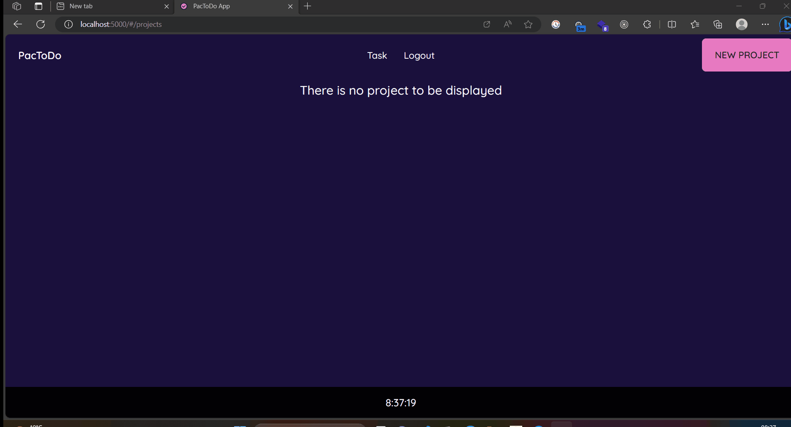
Users are required to create a new project before adding a new task, especially if they don't have any existing projects at the time. When user click add new project button, the app will display a form for submitting new project. The app will sent POST request to `api/projects` then the new project data is saved to database. Next, the frontend will render new project data to be displayed. If adding project is failed, a window alert will be displayed. 
#### Edit Project
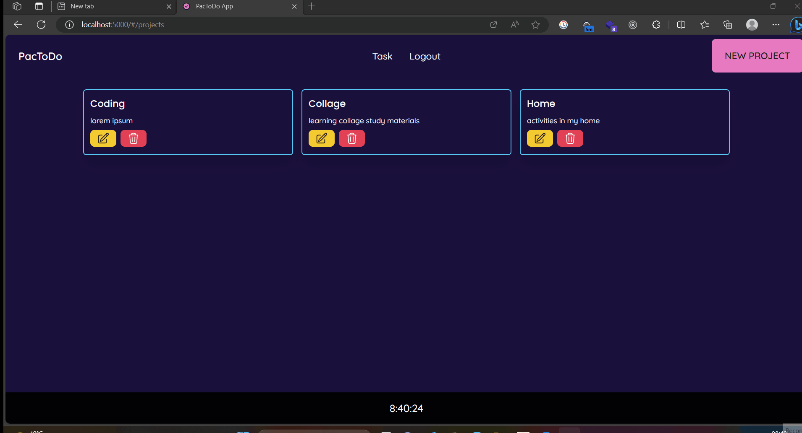
Form for editing project will be displayed after user click the edit project button. If the user clicks the 'Save' button, the edited project data will be sent to the database via the `api/projects/project_id` endpoint using the PUT method. If the process is successful, the frontend will render the edited project. In case of a failed project edit, a window alert will be displayed.
#### Delete project
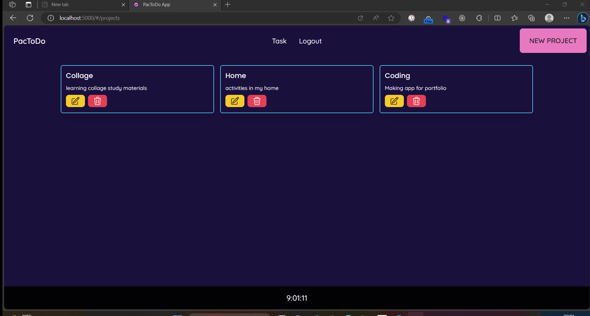
Clicking delete project button will trigger the app to send DELETE request to `api/projects/project_id` endpoint. The deleted project will not be displayed when the deletion process is success. All tasks associated with the deleted project will be removed as well. A window alert will be displayed when deletion process is failed.
#### Add task
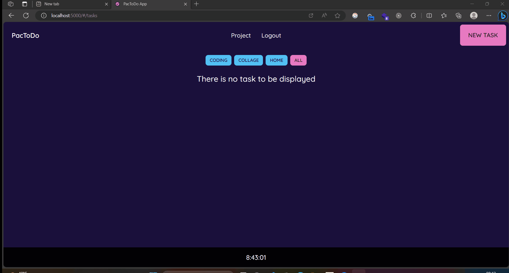
 When user click add new task button, the app will display a form for submitting new task. The app will sent POST request to `api/tasks` then the new task data is saved to database. Next, the frontend will render new task data to be displayed. If adding task is failed, a window alert will be displayed.
 #### Edit task
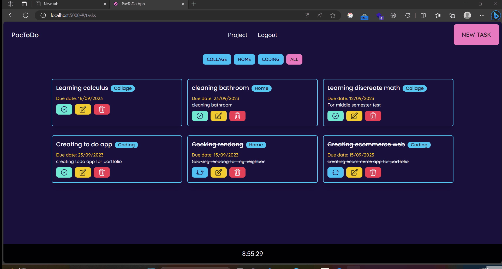
Form for editing task will be displayed after user click the edit task button. If the user clicks the 'Save' button, the edited task data will be sent to the database via the `api/tasks/task_id` endpoint using the PUT method. If the process is successful, the frontend will render the edited task. In case of a failed task edit, a window alert will be displayed.  
#### Mark task as done
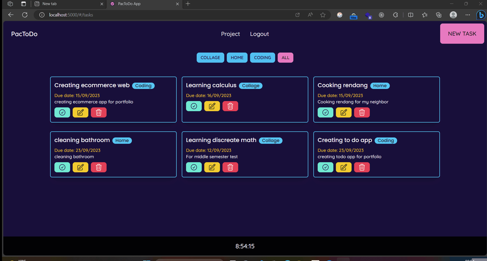
When a user clicks the green checkmark button, the app sends a PUT request to `api/tasks/task_id` with the request body containing task data, with the `is_done` attribute set to `true`. If the process succeeds, the task will be rendered with a strikethrough effect on its text. Additionally, the green checkmark button will be replaced with a blue undo button. Clicking the blue undo button triggers the same process, but with the `is_done` attribute set to `false`, rendering the task as it was before the checkmark button was clicked. The tasks are sorted by `is_done` value. In case of a failed process, a window alert will be displayed.
##### Filter task by project
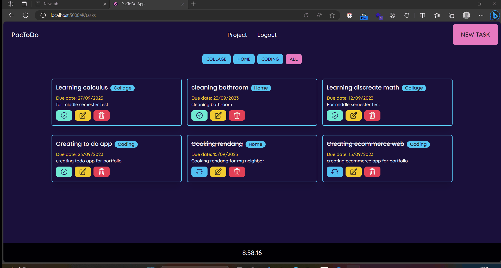
By default, the active filter button is set to 'All,' which does not filter any projects. When a user clicks on one of the filter project buttons, the app will only display tasks that are associated with the clicked filter button.
#### Delete task
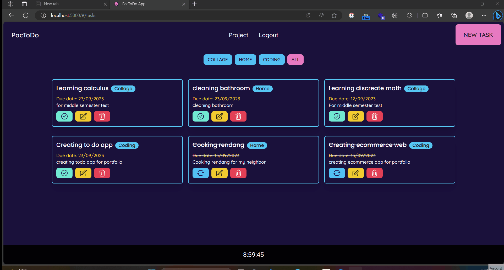
Clicking delete task button will trigger the app to send DELETE request to `api/tasks/task_id` endpoint. The deleted task will not be displayed when the deletion process is success. A window alert will be displayed when deletion process is failed.
#### Logout
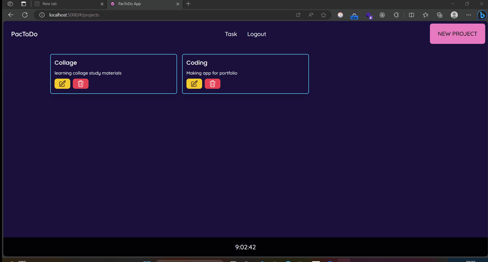
When a user clicks the logout button, the React app sends a POST request to `api/auth/logout`. The user's token is added to the blacklist_token table. If logout is success, all user data will be removed from local storage and the app state. In case the logout failed, a window alert will be displayed to the user.
## Deployment Using Docker
You can find the deployment documentation in [this repository](https://github.com/naputami/Todo_App_deployment#pactodo-deployment-using-docker)

## How to run this app
1. Clone this repository
```
git clone https://github.com/naputami/Fullstack-TodoApp.git
```
2. Create a .env file and set value for SQLALCHEMY_DATABASE_URI, JWT_SECRET_KEY, POSTGRES_USER, POSTGRES_PASSWORD, and POSTGRES_DB.
3.  Make sure that you have installed docker desktop and run this command
```
docker compose up
```
4. You can access the application via localhost:80.
## Conclusion
All of the application's features currently function as expected. However, there are areas that can be enhanced in the future, including:
- Enhancing UI Design for improving intuitiveness and accessibility.
- Enhancing the notification system to make notifications more user-friendly.
- Enhancing the database design to accommodate more detailed user data.
- Adding additional features to enhance UX, such as searching for projects by name and sorting tasks by due date and status.
